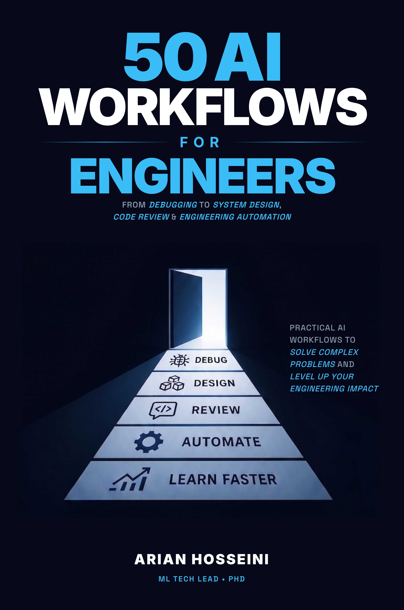

# Book Review: 50 AI Workflows for Engineers

> A solid, practical read. The debugging and PR workflows alone have already saved me a couple of hours this week.

<p align="center">
  
</p>

<p align="center">
  <strong>50 AI Workflows for Engineers: From Debugging to System Design, Code Review & Engineering Automation</strong>
</p>

<p align="center">
  <a href="https://www.amazon.com/Workflows-Engineers-Debugging-Engineering-Automation-ebook/dp/B0GZHP3X8L">📘 Get the Kindle eBook</a> · <a href="https://www.amazon.com/Workflows-Engineers-Debugging-Engineering-Automation/dp/B0GZJNMY9C">📖 Get the Paperback</a>
</p>

<p align="center">
  ⭐ <em>If these workflows save you time, please consider starring this repo.</em>
</p>

---

## The Problem

The average engineer wastes **5 to 10 hours per week** on tasks AI could handle in minutes. Not because AI isn't capable. Because most engineers use it like a search engine — one question, one answer, move on.

The top 1% of engineers use AI like a **senior engineering partner**: multi-step workflows with specific prompts, structured outputs, and systematic integration into their daily work.

## What's Inside

50 practical, copy-paste-ready workflows covering:

| Part | Chapters | Topics |
|------|----------|--------|
| **I. Daily Engineering** | 1–10 | Ticket planning, PR descriptions, debugging, documentation, code review |
| **II. Code & Architecture** | 11–20 | Legacy code, refactoring, incident response, performance optimization |
| **III. System Design** | 21–30 | Architecture, API design, database modeling, trade-off analysis |
| **IV. Quality & Process** | 31–40 | Testing, evaluation pipelines, security scanning, CI/CD |
| **V. Advanced** | 41–50 | Personal AI assistants, multi-model strategies, vibe coding, AI agents |

## Sample Workflows

### Workflow #1: Turn a Vague Ticket into an Implementation Plan

```
Here's my ticket:

Title: "Improve search performance"
Description: "Search is slow for some users. Look into it."

Break this into an implementation plan:
1. What questions do I need answered before writing code?
2. What are the likely root causes (ranked by probability)?
3. What's the investigation sequence?
4. For each likely cause, what's the fix and estimated effort?
5. What's the recommended approach and why?

Context: Python/Django app, PostgreSQL, ~2M records in the
search table, ElasticSearch for full-text search.
```

### Workflow #19: Incident Response in Real-Time

```
I'm responding to a production incident. Here's what I know:

Alert: API response time p99 > 5s (normally 200ms)
Started: 12 minutes ago
Services affected: user-api, search-service
Recent deployments: search-service deployed 45 min ago

Based on this information:
1. What's the most likely root cause?
2. What commands should I run to confirm?
3. What's the fastest path to mitigation?
4. Should I rollback immediately or investigate first?
```

### Workflow #34: Build an LLM-as-Judge Evaluation Pipeline

```
I need to evaluate my LLM application's output quality at scale.
Design an evaluation pipeline using the LLM-as-Judge pattern:

Application: Customer support chatbot
Quality dimensions to evaluate:
- Accuracy (factual correctness against our knowledge base)
- Helpfulness (does it actually solve the customer's problem?)
- Tone (professional, empathetic, not robotic)

For each dimension, design:
1. A scoring rubric (1-5 scale with specific criteria)
2. A judge prompt that evaluates responses consistently
3. A calibration method (how do I verify the judge is reliable?)
4. An aggregation strategy for overall quality scores
```

## Every Chapter Includes

- 🔧 **Step-by-step workflow** with copy-paste prompts
- ⚠️ **What goes wrong** — failure modes and how to handle them
- 📋 **Quick reference card** — use without re-reading the chapter
- 💡 **Real engineering stories** from production systems at scale

## Who This Book Is For

- Software engineers who use AI daily but want to be more systematic
- Tech leads who want to multiply their team's output
- Engineers preparing for system design interviews
- Anyone who's tired of getting mediocre results from ChatGPT/Claude/Copilot

## About the Author

**Arian Hosseini, PhD** is an ML Tech Lead with 60+ papers and patents, an ACM Test-of-Time Award, and experience building production AI systems at Amazon, Microsoft, and other Fortune 500 companies.

## Links

- [Amazon Kindle](https://www.amazon.com/Workflows-Engineers-Debugging-Engineering-Automation-ebook/dp/B0GZHP3X8L)
- [Amazon Paperback](https://www.amazon.com/Workflows-Engineers-Debugging-Engineering-Automation/dp/B0GZJNMY9C)

---

*Stop using AI casually. Start using it systematically.*
